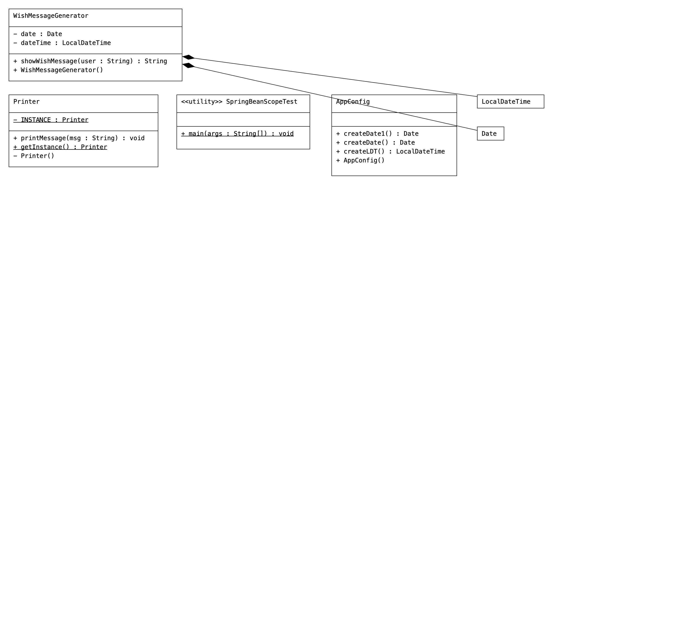

# iocproj07-dependencyinjection-springbeanscopes

# Code
```Java
//AppConfig.java (Configuration class)
package com.nt.config;

import java.time.LocalDateTime;
import java.util.Date;

import org.springframework.context.annotation.Bean;
import org.springframework.context.annotation.ComponentScan;
import org.springframework.context.annotation.Configuration;
import org.springframework.context.annotation.Scope;

import com.nt.ston.Printer;

@Configuration
//@ComponentScan(basePackages = {"com.nt.sbeans","com.nt.ston"})
@ComponentScan(basePackages = "com.nt")
//@Lazy(true)
public class AppConfig {
	
	public AppConfig() {
		System.out.println("AppConfig:: 0-param constructor");
	}
	
	@Bean(name="ldt")
	//@Bean
	@Scope("prototype")
	public   LocalDateTime createLDT() {
		System.out.println("AppConfig.createLDT()");
		return  LocalDateTime.now();
	}

	@Bean(name="dt1")
	@Scope("prototype")
	public  Date  createDate() {
		System.out.println("AppConfig.createDate()");
		return  new Date();
	}
	
	@Bean(name="dt2")
	@Scope("singleton")
	public  Date createDate1() {
		return  new Date();
	}
	

	/*	@Bean(name="prn1")
		@Scope("singleton")
		public  Printer  createPrinter1() {
			return  Printer.getInstance();
		}*/
		
	/*	@Bean(name="prn")
		@Scope("prototype")
		public  Printer  createPrinter2() {
			return  Printer.getInstance();
		}
	*/
}
```
```Java
//SpringBeanScopeTest.java (Client App)
package com.nt.main;

import java.time.LocalDateTime;
import java.util.Date;

import org.springframework.context.annotation.AnnotationConfigApplicationContext;

import com.nt.config.AppConfig;
import com.nt.sbeans.WishMessageGenerator;
import com.nt.ston.Printer;

public class SpringBeanScopeTest {

	public static void main(String[] args) {
		//create the IOC container 
		AnnotationConfigApplicationContext ctx=   
				  new AnnotationConfigApplicationContext(AppConfig.class);
		System.out.println("--------------------------------------");
		  LocalDateTime  ldt=ctx.getBean("ldt",LocalDateTime.class);
		  System.out.println("-------------------");
		  Date  d1=ctx.getBean("dt1",Date.class);
		  System.out.println(ldt+"....."+d1);
	/*	System.out.println("------------------------------");
		
			 WishMessageGenerator generator1=ctx.getBean("wmg",WishMessageGenerator.class);
			 WishMessageGenerator generator2=ctx.getBean("wmg",WishMessageGenerator.class);
			 System.out.println(generator1.hashCode()+"   "+generator2.hashCode());
			 
			 System.out.println("generator1==generator2"+(generator1==generator2));*/
			 
			 System.out.println("----------------------------");
		/*	 Date d1=ctx.getBean("dt1",Date.class);
			 Date d2=ctx.getBean("dt1",Date.class);
			 System.out.println(d1.hashCode()+"  "+d2.hashCode());
			
			 System.out.println("------------------------------");
				
			 Date d11=ctx.getBean("dt2",Date.class);
			 Date d22=ctx.getBean("dt2",Date.class);
			 System.out.println(d11.hashCode()+"  "+d22.hashCode());*/
		
		/*    Printer p1=ctx.getBean("prn1",Printer.class);
		    Printer p2=ctx.getBean("prn1",Printer.class);
		    System.out.println(p1.hashCode()+"  "+p2.hashCode());
		    
		    
		    Printer p11=ctx.getBean("prn2",Printer.class);
		    Printer p22=ctx.getBean("prn2",Printer.class);
		    System.out.println(p11.hashCode()+"  "+p22.hashCode());*/
		    
		    
		/* Printer p11=ctx.getBean("prn",Printer.class);
		    Printer p22=ctx.getBean("prn",Printer.class);
		    System.out.println(p11.hashCode()+"  "+p22.hashCode());
		 */
			 
		/*	 Printer p=ctx.getBean("printer",Printer.class);
			 System.out.println(p);
			 System.out.println("---------------------------");
			 LocalDateTime  dt=ctx.getBean("createLDT",LocalDateTime.class);
			 System.out.println(dt);
		*/

		//close the container
		ctx.close();
		System.out.println("----------------------------");
        
		
	}

}
```
```Java
//WishMessageGenerator(target class)
package com.nt.sbeans;

import java.time.LocalDateTime;
import java.util.Date;

import org.springframework.beans.factory.annotation.Autowired;
import org.springframework.beans.factory.annotation.Qualifier;
import org.springframework.context.annotation.Lazy;
import org.springframework.context.annotation.Scope;
import org.springframework.stereotype.Component;

@Component("wmg")
//@Lazy(true)
@Scope("singleton")
public class WishMessageGenerator {
	@Autowired   // Filed Injection
	private  LocalDateTime dateTime;  //HAS-A property/Filed
	@Autowired
	@Qualifier("dt1")
	private   Date  date;
	
	
	
	public WishMessageGenerator() {
		System.out.println("WishMessageGenerator::0-param constructor");
	}
	
/*	@Autowired
	public WishMessageGenerator(LocalDateTime dateTime) {
		this.dateTime=dateTime;
		System.out.println("WishMessageGenerator::1-param constructor");
	}*/
	
	/*@Autowired
	public WishMessageGenerator(LocalDateTime dateTime,Date date) {
		this.dateTime=dateTime;
		this.date=date;
		System.out.println("WishMessageGenerator::2-param constructor");
	}*/
	
	/*//setter method for  setter injection
	@Autowired
	 public void setDateTime(LocalDateTime  dateTime) {
		 System.out.println("WishMessageGenerator.setDateTime()");
		 this.dateTime=dateTime;
	 }*/
	
/*	@Autowired
	public  void  assign(LocalDateTime dateTime) {
		System.out.println("WishMessageGenerator.assign()");
		this.dateTime=dateTime;
	}
	
	@Autowired
	public  void  putData(Date date) {
		System.out.println("WishMessageGenerator.putData()");
		this.date=date;
	}*/
	
	
	
	// b.method having b.logic
	public String showWishMessage(String user) {
		System.out.println(dateTime+"......"+date);
		//get current hour of the day
		 int hour=dateTime.getHour(); //24 hours format
		 //generate the wish message
		 if(hour<12)
			 return "Good Morning:"+user;
		 else if(hour<16)
			 return "Good Afternoon:"+user;
		 else if(hour<20)
			 return "Good Evening::"+user;
		 else
			 return "Good Night :"+user;
			 
	}

}
```

```Java
package com.nt.ston;

import org.springframework.context.annotation.Scope;
import org.springframework.stereotype.Component;

//@Component
@Scope("prototype")
public class Printer {
	//private static ref variable to that single obj
	private static  Printer INSTANCE;
	
	private Printer() {
		System.out.println("Printer:: 0-param constructor");
	}
	
	//public static factory  method having singleton logic
	public static  Printer  getInstance() {
	   //singleton logic
		 if(INSTANCE==null)
			 INSTANCE=new Printer();
		 
		 return INSTANCE;
	}
	
	//b.method
	public  void printMessage(String msg) {
		System.out.println(msg);
	}

}
```
# Dependencies
```xml
    <dependencies>
        <dependency>
            <groupId>junit</groupId>
            <artifactId>junit</artifactId>
            <version>4.11</version>
            <scope>test</scope>
        </dependency>

        <!-- https://mvnrepository.com/artifact/org.springframework/spring-context-support -->
        <dependency>
            <groupId>org.springframework</groupId>
            <artifactId>spring-context-support</artifactId>
            <version>6.1.5</version>
        </dependency>

        <!-- https://mvnrepository.com/artifact/jakarta.annotation/jakarta.annotation-api -->
        <dependency>
            <groupId>jakarta.annotation</groupId>
            <artifactId>jakarta.annotation-api</artifactId>
            <version>2.1.1</version>
        </dependency>
      
    </dependencies>
```

# UML
